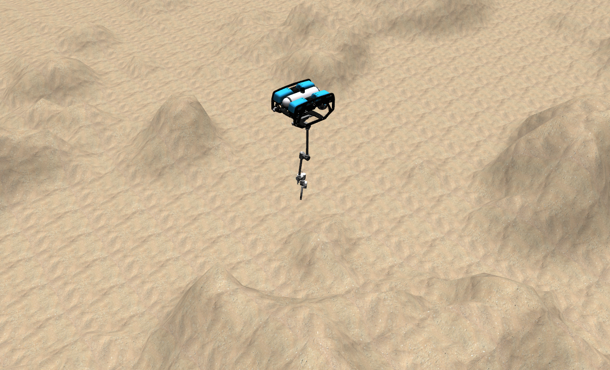

# BlueROV & HDT arm

This repository is in development. 

## Install

```
cd ~/catkin_ws/src
git clone https://github.com/wangcongrobot/hdt_angler.git
git clone https://github.com/wangcongrobot/bluerov2.git
cd ..
catkin_make
source devel/setup.bash
```

```
roslaunch uuv_gazebo_worlds ocean_waves.launch
roslaunch bluerov2_gazebo start_pid_controller_hdt_demo.launch
```

